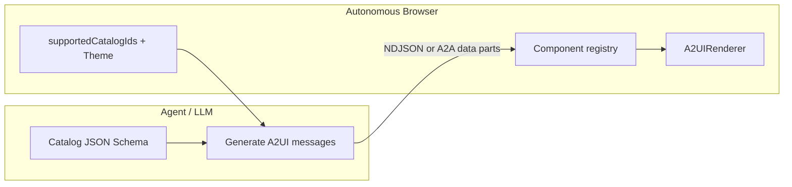

# A2UI integration roadmap (Autonomous Browser)

This document is the **end-to-end flow** for everything described in the upstream A2UI docs: **custom catalogs**, **client–agent catalog agreement**, **theming**, **semantic hints**, and **security**. Work proceeds in phases; each phase should be finished and verified before the next.

---

## Final target architecture

1. **Catalog** — JSON Schema lists allowed component names and props; the host registers **only** matching React implementations.
2. **Capabilities** — The client advertises which `catalogId`s it supports (standard v0.8 today; custom IDs in a later phase).
3. **Theme** — Renderer-controlled: semantic `usageHint` from the agent + **host** `Theme` (`additionalStyles` + design tokens).
4. **Validation** — Strict v0.8 Zod validation before `processMessages` (already in `a2ui-strict-validate.ts`).

---

## Phase 1 — Theming and host tokens (**implemented**)

**Goal:** A2UI panels visually match the browser shell (Orion themes: `--accent`, `--text`, `--bg*`, etc.) and **update when the user switches theme**.

**Deliverables**

- `buildA2uiHostTheme()` in `src/renderer/theme/a2ui-host-theme.ts` merges `@a2ui/react` `defaultTheme` with `additionalStyles` that reference **CSS variables** from `app.css` / Tailwind bridge.
- `A2uiHostProvider` in `src/renderer/components/a2ui/a2ui-host-provider.tsx` wraps chat `A2UIProvider` and rebuilds theme when `document.body` theme classes change (and on `storage` for cross-tab).
- `style-a2ui-host-tokens.css` — capture-scope typography / inheritance.

**Verify:** Open Intelligent chat, send A2UI that renders `Text` + `Button` + `Card`; switch **Settings → Theme** and confirm colors update without reload.

---

## Phase 2 — Catalog IDs and agent prompts (**implemented**)

**Goal:** One source of truth for **which catalog** the host implements, aligned with upstream “announce support” guidance.

**Deliverables**

- `src/shared/a2ui-host-catalog.ts`: `getHostSupportedCatalogIds()`, `hostCatalogSupportPromptSection()`.
- `src/shared/a2ui-catalog-constants.ts`: shared catalog URL (no import cycles with LLM prose).
- `a2ui-llm-instruction.ts`: appends `hostCatalogSupportPromptSection()` to both short and long A2UI appendices.

**Verify:** System prompt appendix includes the catalog support paragraph (inspect intelligent settings / prompt preview if present).

---

## Phase 3 — A2A wire metadata (**implemented** for `GoogleA2uiClient`)

**Goal:** When talking to an A2A agent, send **client capabilities** (`a2uiClientCapabilities` / `supportedCatalogIds`) per the [v0.8 A2A extension](https://a2ui.org/specification/v0.8-a2a-extension/).

**Deliverables**

- `src/shared/a2ui-a2a-metadata.ts` — `buildA2uiClientMessageMetadata()` returns `Message.metadata` with `a2uiClientCapabilities` (defaults `acceptsInlineCatalogs: false`).
- `GoogleA2uiClient.send()` passes `metadata: buildA2uiClientMessageMetadata()` on every outbound `message/send` (HTTP header `X-A2A-Extensions` unchanged).

**Verify:** Inspect JSON-RPC payload (devtools / agent logs): `params.message.metadata.a2uiClientCapabilities.supportedCatalogIds` lists the v0.8 standard catalog URI.

---

## Phase 4 — Host catalog policy (**v0.8 subset — implemented**)

**Goal:** After strict Zod validation, optionally restrict which **standard** v0.8 component keys may appear in `surfaceUpdate` (design-system / safety subset). True custom widgets + new JSON Schema remain a **v0.9 / registry** follow-up.

**Deliverables**

- `src/shared/a2ui-catalog-constants.ts` — `A2UI_V08_STANDARD_COMPONENT_KEYS` (single source of truth).
- `src/shared/a2ui-host-catalog-policy.ts` — `A2UI_HOST_COMPONENT_ALLOWLIST` (default `null` = full catalog), `getEffectiveHostComponentAllowlist()`, `validateHostCatalogPolicy()`, `hostCatalogPolicyPromptSupplement()`.
- `A2uiChatSurface` — runs `validateHostCatalogPolicy` after `validateA2uiJsonlLinesStrict`.
- `a2ui-llm-instruction.ts` — when `A2UI_HOST_COMPONENT_ALLOWLIST` is non-empty, appends `hostCatalogPolicyPromptSupplement()` to A2UI appendices.

**Configure:** Set `A2UI_HOST_COMPONENT_ALLOWLIST` to a non-empty subset of `A2UI_V08_STANDARD_COMPONENT_KEYS` (e.g. `["Column","Row","Text","Button"]`) to enforce at runtime + in prompts.

**Future (custom components / v0.9):** New component **types** beyond the standard schema need `@a2ui/react/v0_9`, `ComponentRegistry.register`, and matching agent schema — not covered by this subset policy alone.

---

## Phase 5 — Security hardening (**prompt + docs baseline**)

**Goal:** Match upstream guidance: validate, allowlist components, and keep models aware of trust boundaries.

**Implemented in-repo**

- **Validation:** `a2ui-strict-validate.ts` + `A2uiChatSurface` apply only strict v0.8 Zod-valid messages to `processMessages`.
- **Allowlist:** `@a2ui/react` default catalog registers known components only; unknown types do not render.
- **Model instructions:** `src/shared/a2ui-host-security.ts` — `hostA2uiSecurityPromptSection()` / `hostA2uiSecurityPromptOneLiner()` wired into `generateA2uiSystemPromptAppendix` (long + short).
- **Escape hatch:** `A2UI_HOST_LLM_COMPAT` in `a2ui-jsonl.ts` (default `false`) called out in the security prompt.

**Ongoing / after Phase 4**

- [ ] Re-audit when adding **custom** `ComponentRegistry` entries or enabling **inline** catalogs.
- [ ] Keep `acceptsInlineCatalogs: false` in `buildA2uiClientMessageMetadata()` unless the agent pipeline is fully trusted.

---

## Execution order

| Step | Phase | Action |
|------|--------|--------|
| 1 | 1 | Land host theme + `A2uiHostProvider` |
| 2 | 2 | Land catalog constants + prompt appendix |
| 3 | 3 | A2A `message.metadata` — `buildA2uiClientMessageMetadata` + `GoogleA2uiClient.send` |
| 4 | 4 | Host subset policy (`a2ui-host-catalog-policy.ts`); v0.9 custom types optional later |
| 5 | 5 | Security prompts + checklist (`a2ui-host-security.ts`, this section) |

---

## References

- Standard catalog (v0.8): `https://a2ui.org/specification/v0_8/standard_catalog_definition.json`
- A2A extension (client capabilities on each message): `https://a2ui.org/specification/v0.8-a2a-extension/`
- In-repo prompts: `src/shared/a2ui-llm-instruction.ts`
- Theme builder: `src/renderer/theme/a2ui-host-theme.ts`
- A2A metadata helper: `src/shared/a2ui-a2a-metadata.ts`
- Security prompt helpers: `src/shared/a2ui-host-security.ts`
- Host catalog subset policy: `src/shared/a2ui-host-catalog-policy.ts`
